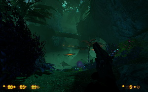
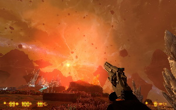
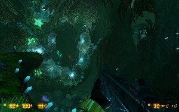

https://youtu.be/YkBrNGeFwoU

Легендарный, но уже откровенно постаревший Half-Life тщательно отретушировали и дополнили кучей новых задумок. Вышло здорово; прям видно, что фанаты старались :-) Особенно Зену пошло на пользу — разве что завод, по-моему, стоило сделать покороче. Впрочем, бой с Нихилантом переделали так, что он с лихвой окупает все страдания.

Есть мелкие косяки с музыкой, оптимизацией и переводом, но ничего особо критичного. Учитывая, сколько шла разработка — удивительно, что вообще дошло до релиза сквозь типичные для долгих проектов проблемы вроде усталости и выгорания команды. И это не считая титанической работы по переделке проекта двадцатилетней давности на современные рельсы! Quite a nasty piece of work you managed over there, guys. I am impressed.

   