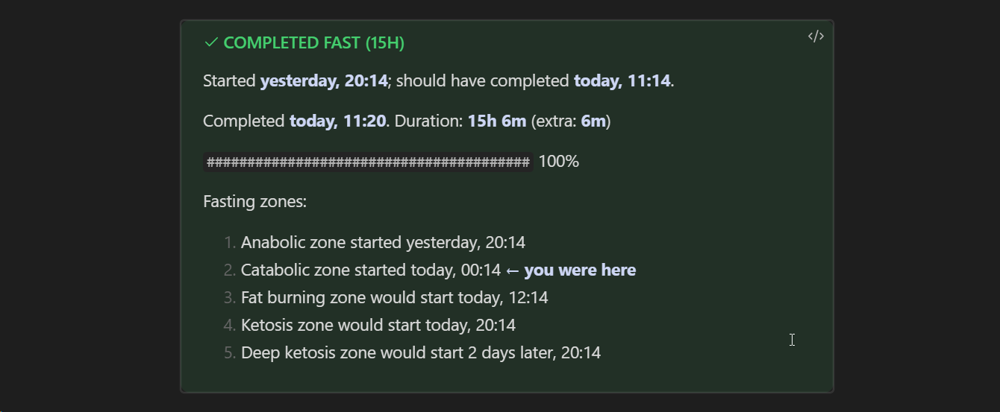

Завернул отрисовку [Фастаймера](notes/obsidian-fastimer) через выноски: это механика Obsidian, позволяющая превращать обычную цитату в оформленный блок текста, привлекающий внимание читателя. Вы наверняка видели блоки в духе «совет» и «обрати внимание» — вот это и есть выноски. 

Подробнее можно прочитать в [справке](https://help.obsidian.md/Editing+and+formatting/Callouts) Obsidian.

В общем, теперь таймер принимает разный цвет в зависимости от состояния (активный интервал — голубой, успех — зеленый, провал — красный). Кроме того, я немного уплотнил текст и отточил формулировки:

Получилось компактнее и симпатичнее блока неформатированного текста, который я использовал до этого.