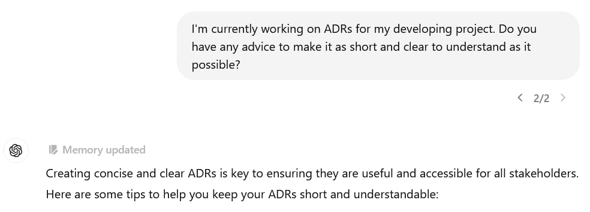
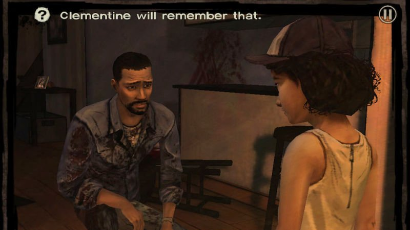

Когда ChatGPT запоминает какую-то деталь диалога на будущее, он рисует над своим ответом плашку "Memory updated". Типа, я понял:

Каждый раз смешно: сразу вспоминается The Walking Dead и мем "Клементина запомнит это" :) В этой игре персонажи, окружающие протагониста, запоминали его решения и это оказывало влияние на их поведение. В том числе и Клементина — девочка, которую главный герой спасает в начале игры.

В игре эта механика была сделана, если честно, так себе, а вот ChatGPT и правда все запоминает. Внимание к деталям такое, что иногда приходится напоминать себе, что разговариваешь с языковой моделью, а не с необыкновенно участливым и очень эрудированным человеком.