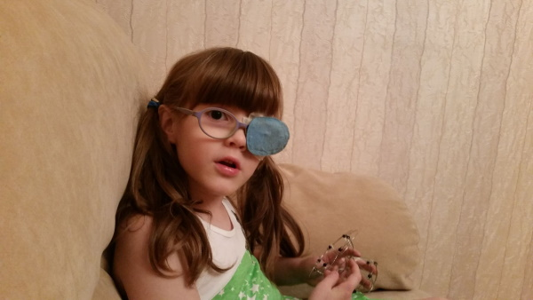

Дочка спрашивает: пап, а что значит «молиться»?

Я объясняю — смотри, мол, некоторые люди верят в могущественное существо, которое живет на небе и управляет всем-всем-всем. Люди время от времени это существо о чем-то просят, вот это и называется молитвой.

Мелкая, подумав:

— Пап, эти люди, они совсем ленивые, да?

