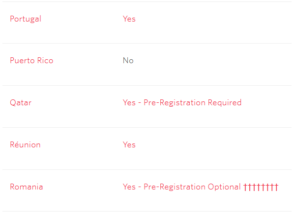

Делаю для нашего клиентского портала функцию восстановления пароля через SMS. Добрался до [документации](https://support.twilio.com/hc/en-us/articles/223133767-International-support-for-Alphanumeric-Sender-ID) Twilio о поддержке [буквенно-цифрового ID отправителя](https://www.twilio.com/docs/glossary/what-alphanumeric-sender-id) в разных странах; эта фича позволяет отправлять сообщения так, чтобы получатель видел не номер отправителя, а что-то осмысленное (название компании, например). 

При этом фича везде зарегулирована по-своему: где-то просто работает, а где-то нужна регистрация.

Читаю:

🤔

- Португалия: да
- Пуэрто-Рико: нет
- Катар: да (с регистрацией)
- Реюньон: да
- Румыния: да (с регистрацией) (но бойтесь Дракулы)

Не знаю, как ещё объяснить это кладбище.

UPD: Нашёл разгадку. Могильные кресты означают, что за регистрацию нужно заплатить 700 баксов. 

Объяснение про Дракулу мне нравилось больше.