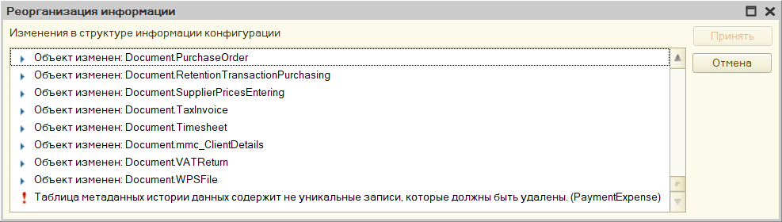
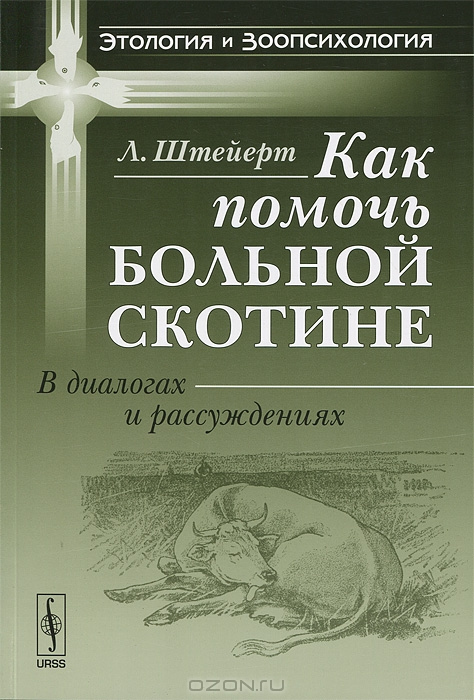

В очередной раз столкнулся с противным багом, при котором платформа ломает таблицу с метаданными истории данных. 

Внешне он выглядит так: вы обновляете конфигурацию базы, и при попытке реструктуризации выскакивает ошибка "Таблица метаданных истории данных cодержит не уникальные записи, которые должны быть удалены". 

При этом платформа не предлагает никакого понятного способа найти такие записи — иди туда, не знаю куда, сделай то, не знаю что.   

Проблему можно решить, порывшись в базе данных. Таблица, на которую ссылается ошибка — _DataHistoryMetadata. В ней лежат версии метаданных каждого объекта, для которого ведётся история. Это позволяет платформе отвечать на вопрос "какие реквизиты есть у этого объекта?" в любой момент времени, в течении которого для объекта велась история.

Как это работает? Ну, когда меняется состав реквизитов объекта (например, реквизит в справочнике добавили), платформа запоминает его метаданные: конкретно, добавляет в _DataHistoryMetadata новую запись и сохраняет в ней актуальный список реквизитов объекта, а также номер версии этого списка (например, в при включении истории для объекта сохраняется первая версия метаданных, при добавлении какого-нибудь реквизита — вторая и так далее).

Ещё платформа ставит в созданной записи отметку, что именно эта версия объекта — самая актуальная, после чего снимает этот флаг со всех других версий метаданных этого объекта.

Так вот, проблема в том, что платформа иногда забывает сделать последний шаг и две версии одновременно становятся актуальными. Она понимает это, но сделать уже ничего не может. 

Решение вытекает из алгоритма выше: нужно найти конфликтующие версии и отобрать признак актуальности у той, что старше. Лучше использовать запросы: история данных, как правило, включается для множества объектов, состав их реквизитов постоянно меняется — в общем, версий в таблице будет столько, что черт ногу сломит.

Если вы тоже столкнулись с этой проблемой и поэтому читаете этот текст — можете воспользоваться [запросами](https://gist.github.com/vkostyanetsky/6496c67e2b2fd3d064c4cafd16da0b79), что написал я:

1. get-issues.sql проверяет, что проблема есть: ищет версии метаданных, которые одновременно помечены как актуальные.
2. fix-issues.sql снимает признак актуальности с тех версий, которые на самом деле устарели.

Оба запроса написаны для Microsoft SQL Server. Если вы используете PostgreSQL, то [вот они же](https://gist.github.com/vkostyanetsky/75665ce04247e900743604eb386d1889) для этой СУБД.

Обратите внимание, что запросы потребуют небольшой адаптации под конкретную базу: в них используется поле _fld626, в котором хранится разделитель данных. В вашем случае это поле может называться иначе, поэтому перед выполнением запросов нужно заменить это поле на то, которое есть в вашей таблице _DataHistoryMetadata. Ошибиться будет трудно — у неё только одно поле с префиксом _fld.

P.S. Напоминаю, что лицензионное соглашение запрещает ковыряться в базе данных в обход средств платформы, так что на такие эксперименты можно идти, только если других вариантов не осталось.