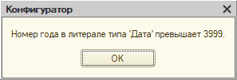

Итак, в ходе рутинного пересчета итогов из Конфигуратора мы неожиданно получили ошибку «номер года в литерале типа дата превышает 3999». Это значит, где-то в базе есть (или пытается появиться) дата больше, чем предельно допустимая с точки зрения 1С (31.12.3999 23:59:59).

Ладно, что с этим делать?

Главное — выйти на конкретную таблицу с проблемными датами. Ошибка возникла при пересчете итогов, так что очевидно: искать нужно в регистрах. Открываем стандартную обработку управления итогами, делаем пересчет и [получаем](totals.png) имя регистра, на котором спотыкается платформа.

Другой, более методологически правильный подход — настроить сбор ТЖ (SDBL, EXCP и EXCPCNTX) и получить примерно [такой](excp.log) лог. Ищем в нём событие EXCP (исключение), а непосредственно перед ним — событие SDBL (SQL-запрос в терминах платформы). Этот запрос — причина сбоя; в его тексте видим имя нужной нам таблицы (AccumRgTn11530). Имя объекта конфигурации для неё можно вытащить любой обработкой, построенной на методе ПолучитьСтруктуруХраненияБазыДанных().

В общем, так или иначе мы получим имя регистра. Открываем его форму и простой сортировкой по периоду выходим на [проблемные движения](entries.png). Нужно проанализировать документы, которые их сделали, устранить причину ошибки и перепровести документы. Если после этого проблема с пересчетом останется — это либо не единственная таблица с проблемными датами (ищем дальше), либо эти даты успели засесть где-то ещё, кроме таблицы движений.

Например, у меня был случай, когда после исправления движений записи с некорректными датами сохранялись в таблице оборотов. Средствами платформы их удалить было нельзя, но размер базы позволял играться с реструктуризацией. Я выкинул следующий финт: отключил признак «Использование в итогах» для всех измерений регистра и применил изменения; потом вернул признак на место и пересчитал итоги. В итоге таблица оборотов регистра была физически удалена, а потом создана и наполнена заново — уже без дат на много веков вперёд.

В крайнем случае можно было удалить проблемные записи с помощью прямых SQL-запросов (DELETE или даже TRUNCATE). Но это, во-первых, нарушает лицензионное соглашение с разработчиками платформы, а во вторых — опасно (по неосторожности можно удалить что-то важное и не заметить). Так что не советую, э-э, повторять в домашних условиях :-)