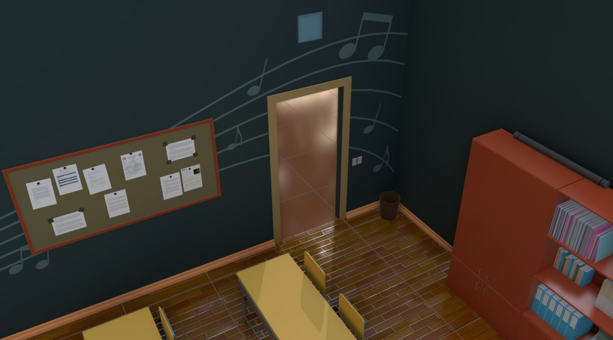

Освоил прикольный трюк с удалением части объекта в том случае, если он с чем-то пересекается. Например, на этой гифке в центре находится модель головы обезьянки; при движении плоскости видно, как её часть (как раз та, что начинает пересекаться с обезьянкой) исчезает.

[Идея](https://github.com/vkostyanetsky/3DPlayground/blob/main/Geometry%20Nodes/DeleteGeometry.blend) довольно простая: сводим геометрию объекта-ограничителя к кубу, вычисляем его минимальные и максимальные координаты по всем осям, а потом для каждой точки «обрезаемого» объекта проверяем, входит ли она в полученный диапазон. Входит? Удаляем.

Способов применения — масса; например, мне это пригодилось, когда я захотел автоматически отрезать часть линий декоративного нотного стана на стене так, чтобы они не пересекали дверной проем.

Конечно, можно было бы сделать это вручную, без геонод, но такой вариант ударил бы по гибкости: изменятся какие-то размеры (ширина стены, размеры двери, угол наклона линий) — всё придётся переделывать.