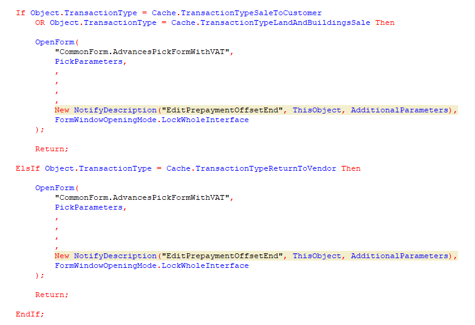



Если вид операции — продажа товара или недвижимости, то открой общую форму AdvancesPickFormWithVAT с параметрами, описанными в структуре PickParameters. Колбеком будет метод EditPrepaymentOffsetEnd, описанный в этом же модуле; передай ему структуру AdditionalParameters. Форму нужно открыть так, чтобы она заблокировала весь интерфейс.

А вот если вид операции — возврат поставщику, то открой общую форму AdvancesPickFormWithVAT с параметрами, описанными в структуре PickParameters. Колбеком будет метод EditPrepaymentOffsetEnd, описанный в этом же модуле; передай ему структуру AdditionalParameters. Форму нужно открыть так, чтобы она заблокировала весь интерфейс.

Смотри не перепутай.