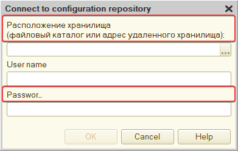

Диалог входа в хранилище конфигурации актуальной версии платформы (8.3.22.1923, если быть точным), запущенной с английским интерфейсом:

Слышал, что развитие Конфигуратора остановилось во многом из-за чудовищного количества технического долга, тормозящего любые новые фичи. Но тут интерфейс поехал прямо на одном из первых окон приложения! Любопытно, как это пролезло через тесты. 

Может, их и вовсе нет.