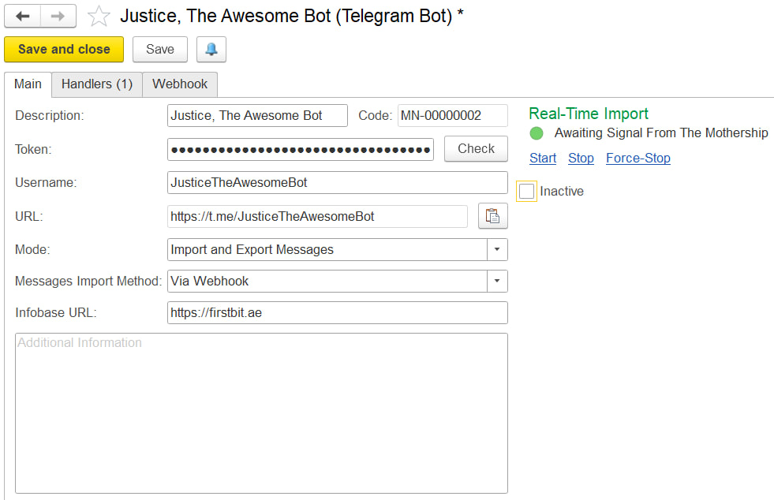
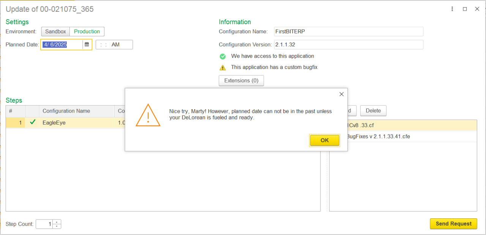

 

Пара пасхалок, которые можно найти внутри FirstBit ERP. Спрятаны для разработчиков: пользователи в первом случае видят на форме заголовок и текст оповещения, а во втором — стандартное waiting for connection.

Люблю время от времени делать такие штуки: это весело, а ещё — помогает не скучать, даже если задача не слишком увлекает или просто устал. Если не читали заметку «[Дизайн без стресса](https://collab.ldwg.ru/stressless-design)» Быстроновского — прочитайте, она клёвая (а я все равно не сформулирую лучше).

Вот, кстати, ещё одна пасхалка. Эта уже не из нашей ERP, а из нового инструмента по автоматическому обновлению баз. Его мы пишем сами для себя, поэтому можно хохмить с пользователем :)

