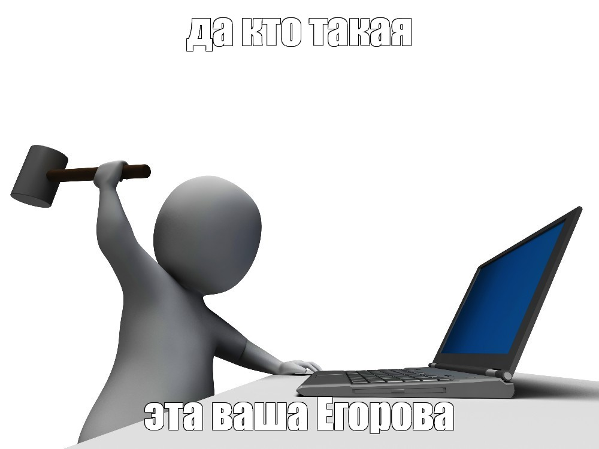

Последние полгода постоянно [использую](/notes/autosummary) Whisper для расшифровки встреч. Заметил забавный эффект: чем толще модель, тем лучше она распознаёт речь и тем увереннее несёт бред там, где речи нет.

Например, такое бывает в начале вебинара или встречи, пока участники собираются. Тихо, все молчат, разве что кто-нибудь шумно тянет кофе. И Whisper внезапно начинает выдавать что-то такое:

> Редактор субтитров А.Синецкая Корректор А.Егорова  
> Редактор субтитров А.Синецкая Корректор А.Егорова  
> Редактор субтитров А.Синецкая Корректор А.Егорова  
> Редактор субтитров А.Синецкая Корректор А.Егорова  

И что хуже, **продолжает выдавать это даже тогда, когда начинается уже вполне разборчивая речь**.

Это здорово раздражало, так что пришлось разобраться.

## Почему тишина так распознается?

Whisper — не просто распознавалка звуков. Внутри там мощная языковая модель, которая пытается подобрать наиболее вероятный текст с учётом аудио и уже распознанного контекста. В общем случае это работает как надо: модель хорошо понимает речь, контекст, имена и сложные фразы. 

Но если на входе тишина, шум или что-то невнятное, звук почти перестаёт быть ей полезен. И вот тут модель начинает гадать: какой текст здесь вообще мог бы быть, хм? Обучена она на гигантском датасете аудио с текстовыми расшифровками, которые OpenAI натаскала со всего интернета (порядка 700 тысяч часов, если не путаю).

Среди этого добра, полагаю, было полным-полно видео с субтитрами — а это штука такая, грязная. Во время тишины в сабах вполне может мелькать имя переводчика, редактора, название студии, «спасибо за просмотр» и прочий мусор, которого в аудио вообще нет. 

Вот так, думаю, Синецкая с Егоровой и вошли в историю. Над чем они работали, я найти не смог, но, видимо, надпись с отсылкой на них мелькала в сабах достаточно часто, чтобы Whisper поставил знак равенства между ними и тишиной. 

## Почему так распознаётся не только тишина?

Угу, если бы всего лишь получали шум во время пауз, это вообще не было бы проблемой: мусорный фрагмент текста известен и его можно просто выкидывать из выдачи. Хуже всего тут то, что ошибка распознавания портит контекст модели — упрощая, Whisper распознаёт тишину как Егорову, подсовывает этот результат себе же как контекст следующего куска и едет дальше с этим знанием.

Следующий кусок, допустим, опять Егорова, и потом тоже, и потом... Когда спикер наконец-то начинает говорить, ему нужно начать ОЧЕНЬ внятно, чтобы модель согласилась, что да, это уже речь, а не Егорова, набравшая силу на двадцати кусках до него. В результате модель способна застрять в этом состоянии очень надолго.

Проблеме сто лет (ну ладно, четыре года) и она существует для множества языков. Русский, кстати, [выбивается](https://github.com/openai/whisper/discussions/928#discussioncomment-5372187) из общего ряда — если итальянцы, французы и испанцы видят скучное «Субтитры созданы сообществом Amara.org», то у нас, так сказать, свой фэндом.

## Как бороться?

Вообще считается, что надо тюнить инференс: сбрасывать контекст после длинных пауз, играться с `no_speech_threshold`, `condition_on_previous_text`, предварительно отрезать тишину с помощью VAD и так далее. До VAD я не добрался, но остальные варианты пробовал — действительно можно добиться вполне сносного результата на конкретном проблемном видео.

Однако мне этот вариант не подошел: мне нужно распознавать самые разные видео — записи встреч, лекции, телефонные разговоры, что угодно. Комбинация приёмов, подобранная для одного видео, не работает для другого. Из инженерного азарта я пробовал собирать обвязку в духе «прогнать видео через три разные комбинации приёмов, а потом проанализировать результат и выбрать тот, где концентрация Егоровой пожиже», но это всё равно работало так себе.

Так что я выбрал другое решение: **использовать модель поглупее!**

Серьёзно, это работает. По крайней мере на моих видео Whisper Small сваливается в repetition loop на тишине сильно реже. Видимо, более слабой модели сложнее уверенно вывести мусорный паттерн, поэтому на тишине она просто не выводит ничего.

Упрощая,

- Whisper Small: Эээ... Ничего не слышу. Непонятно.
- Whisper Medium: Эээ... Ничего не слышу... *(напрягает свои параметры)* А! Знаю! *(вступают фанфары)* Это ж Егорова!

:D Горе от ума, буквально.

Качество расшифровки у Whisper Small получается, конечно, пониже — больше криво распознанных слов, менее связно, но <s>это лучше, чем когда треть звука слопано Синецкой, а остальное поглодала Егорова</s> результат в среднем более предсказуем.

Кроме того, его все равно нужно потом загнать в условный ChatGPT, чтобы собрать саммари, а для этого гигачада восстановить контекст диалога вообще не вопрос, даже если фрагменты реплик потеряны.