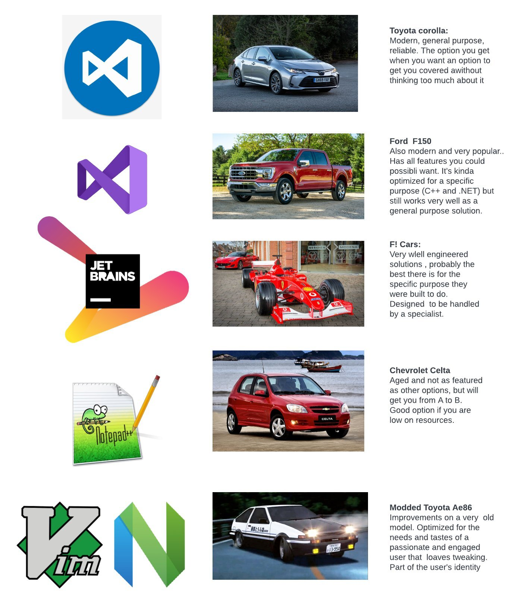



Коллега проворчал, что если продолжать эту логическую цепочку, то конфигуратор будет «Жигулями», а EDT — «Кама1» (это такой электрокар, который много лет пилят где-то в недрах КАМАЗа и всё никак не могут собраться с силами и, наконец, допилить).

Ну а я стараюсь смотреть на вещи с оптимизмом. Думаю, платформа и её IDE — это такие карьерные самосвалы. Никто в здравом уме на них по домашним делам не катает, но на разрезе эти звери незаменимы!