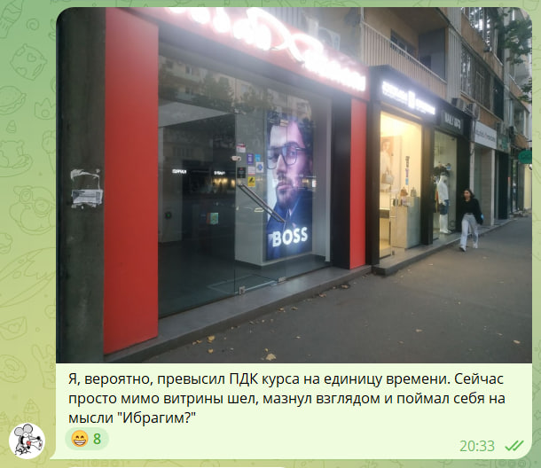

Закатился в [курс по анализу систем](https://tough-dev.school/system-analysis), который проводят ребята из "Школы сильных программистов". Цели у меня две:

1. Во-первых, надо откалиброваться. Много бодаюсь с полдюжиной технических стеков, у которых разный тулсет и понятия о прекрасном. Это, конечно, здорово развивает, но искажает перспективу: меня тянет решать очередную проблему со всяких второстепенных технических штук просто потому, что я с ними лучше знаком. Между тем, если посмотреть на задачу чуть сверху, подумать и порисовать диаграммы — получается более удачное или, хотя бы, более осмысленное решение. Хочу убедить себя делать так почаще.
2. Во-вторых, надо научиться писать внятную документацию для разработчиков. На практике до нее редко доходят руки, а когда доходят — не успеваю поддерживать её в актуальном состоянии. Короче, времени мало, и хочется по крайней мере делать доку как-то так, чтобы читатель живее хватался за мысль.

Сам курс сделан в виде итераций: каждую неделю тебе рассказывают про один тот же проект, который пытается спроектировать главный герой истории, Ибрагим (это он на лендинге по ссылке выше). Каждую неделю проблем с этим проектом все больше и решения, которые выдумывает Ибрагим, становятся все заковыристее. 

Кроме этого, ученикам регулярно выдают "домашнюю работу" — другой проект с похожими проблемами. Его нужно проанализировать и спроектировать по-человечески — снова и снова, учитывая новые знания и ограничения, полученные за неделю.

Пока здорово заходит. Главная проблема — нехватка времени: читаю я сравнительно медленно и стараюсь конспектировать самые интересные или просто сложные места. Между тем, материалов в курсе очень много и все интересные, даже если считать только основную часть. А если проваливаться по дополнительным ссылкам — вообще хоть святых выноси.

Есть ощущение, что если читать вообще все сноски и статьи, на которые ссылается автор — нужно полгода, не меньше. Я старался читать всё хотя бы по диагонали, но это оказалось чертовски плохой идеей: кончилось тем, что главный герой курса начал мне мерещиться в уличной рекламе :)

