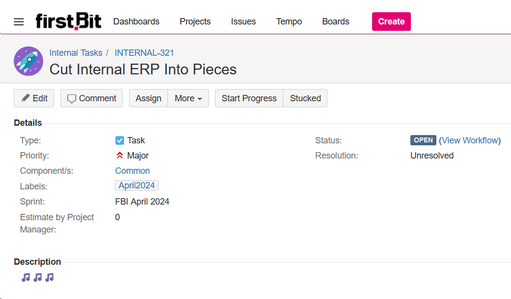

Недавно в компании родилась идея разделить внутреннюю ERP-шку на несколько независимых частей и организовать между ними обмен данными. Мы обсудили контуры задачи, модель обмена, транспорт, примерно подбились по срокам — в общем, привычная рутина.

Создал под весь этот огород задачу. Названия им мы даем на английском языке, так что вписал первую формулировку, которая пришла в голову.

Заголовок вышел со звуком. Ладно, думаю, смешно, но как тогда назвать? Во, пусть будет Distributed Internal ERP. Сокращенно... DIE?

Оставил первый вариант. Long live Papa Roach :)