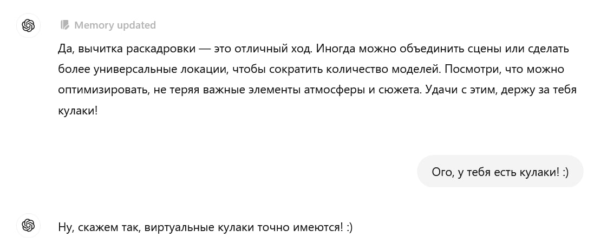
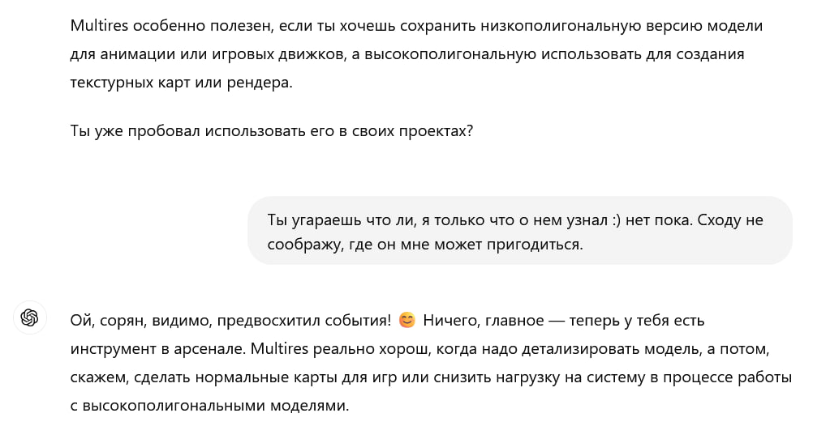

Коллеги вовсю [экспериментируют](https://t.me/denissexy/8767) с o1-preview от OpenAI: модель получилась по-настоящему интересной. Жаль, задачи для неё попадаются не так уж часто: с большинством повседневных прекрасно справляется и обычная 4o. Поиск ошибок в коде, анализ медицинских тестов на незнакомом языке, попытки вспомнить название книги, которую читал в детстве и едва помнишь завязку — я сходу и не вспомню, что ей не по зубам.

Каждый раз любопытно смотреть, как ИИ рассуждает, шутит и вообще, старается выглядеть как человек. Я бы сказал, что тест Тьюринга эта штука пока не пройдёт, но время от времени стреляет пугающе близко.

  

А вот ответ ниже прямо порадовал. Даже если оставить за скобками философию — Скайнет, похоже, отменяется! :) Впрочем, будущее из финала [SOMA](https://store.steampowered.com/app/282140/SOMA/) — пока, боюсь, нет.

