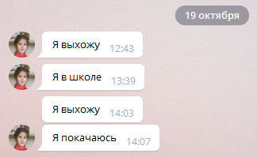

Дочка пишет о своих планах — мол, не теряй меня. А у меня профессиональная деформация: этот вполне нормальный чат мой мозг упорно воспринимает как код на Gherkin. Просто какой-то неправильный, что ли, хочется быстренько пофиксить :-)

    И я выхожу
    Тогда я в школе
    И я выхожу
    Тогда я покачаюсь

Мы на этом языке пишем автотесты нашей конфигурации для [Vanessa Automation](https://github.com/Pr-Mex/vanessa-automation). Вроде не так уж много я их накатал (сравнивая с некоторыми коллегами — баловался, считай). Но, видимо, достаточно.