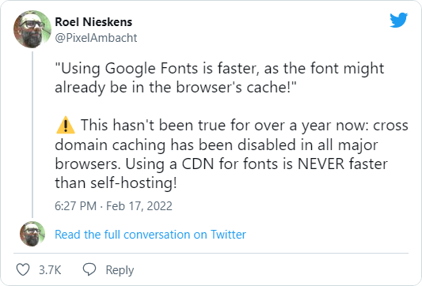

Год назад, блин. Ладно, всем привет! С вами Джонни Слоупок! Сегодня мы будем выпиливать из моего блога работу с Google Fonts. Я подгружал с него основной шрифт (PT Sans), но без кросс-доменного кэширования единственный смысл делать это дальше — если сервер, на котором работает сайт, слабоват и с гугла шрифты грузятся шустрее. 

В моем случае блог отдают сервера гитхаба, которые на производительность не жалуются, так что теперь PT Sans загружается прямо с них. И знаете что? Разница прямо драматическая. Если раньше при обновлении страницы была явно заметна задержка между загрузкой страницы и загрузкой шрифта, то теперь её невооруженным глазом не разобрать. Если у вас свой блог и хотите попробовать — вот тут есть классный [сервис](https://google-webfonts-helper.herokuapp.com/fonts), который решает задачу в несколько кликов.

Не забудьте повесить звезду на [репозиторий](https://github.com/majodev/google-webfonts-helper)!