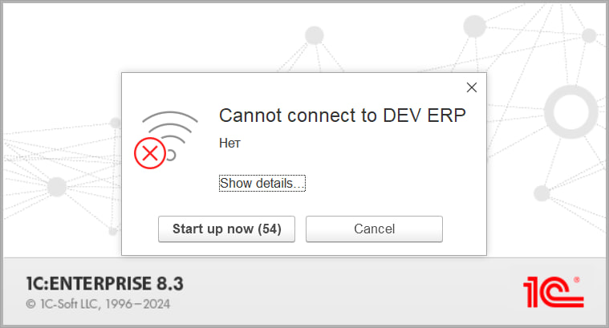

Сообщение, которое выдает актуальная платформа при попытке подключения к выключенному кластеру серверов. Я, конечно, люблю лаконичность в интерфейсах, но тут всё-таки перебор.

Платформа, причем, установлена с единственным языковым пакетом (английским) и даже запущена с жестким указанием на «Ven VLen», но откуда-то всё равно прорастают родные березки. Возможно, сишная библиотека, откуда стреляет сообщение (DataExchangeTcpClientImpl.cpp) в моем случае смотрит на язык ОС (русский), сложно сказать.

В любом случае, не могу избавиться от ассоциаций с Багзом Банни каждый раз, как вижу это окошко.

