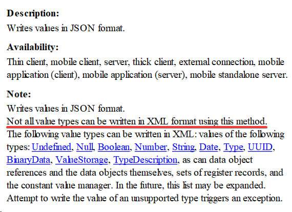

Завидной глубины комментарий из документации к методу WriteJSON() XDTOSerializer'а:

Ну да, метод дампит данные в JSON, а не в XML. Так что поспорить сложно, не все типы данных можно упаковать в XML с его помощью (если быть точным — никакие). Если бы дальше не пошла очевидная копипаста из справки к WriteXML() — счёл бы пасхалкой от разработчиков :)