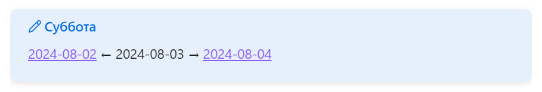

Когда активно работаешь в ежедневных заметках Obsidian'а, часто хочется сунуть нос в заметку за вчера или, наоборот, на завтра. Например, когда сортируешь сегодняшние задачи на и хочешь отложить часть на завтра.

Каждый раз набирать конкретную дату мне лень, поэтому я написал под это [скрипт](https://gist.github.com/vkostyanetsky/6c70f00b817157f9b6e62ee89bade853). Берет дату заметки из её названия (ожидает, что она в формате <abbr title="2024-08-17, например.">ISO 8601</abbr> и рисует выноску со ссылками на вчера и завтра для неё. В заголовке выводит день недели для дополнительного удобства:

Скрипт написан для плагина [Dataview](https://github.com/blacksmithgu/obsidian-dataview), потому что я его и так использую для других задач. Вообще можно легко переделать его для [Templater](https://github.com/SilentVoid13/Templater), [CustomJS](https://github.com/saml-dev/obsidian-custom-js) или отдельный плагин накидать (мне, опять-таки, было лень возиться). 

Если будете использовать: 

1. В функции noteLink() пропишите путь к вашей папке с ежедневными заметками (сейчас в ней папка Days для примера; путь, если забыли, указан в настройке Daily notes/New file location);
2. Закиньте скрипт в шаблон ежедневной заметки (настройка Daily notes/Template file location).