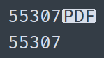

Получаю тикет: клиент не может войти на портал. Смотрю в базе — учетная запись в порядке. Что не так-то? Проверяю логин и вижу чудную картину:

Выше то, что в базе, а ниже — то, что вводит пользователь. Первая мысль: откуда, черт подери, в строке взялся документ? :D 

Опущу дальнейший разбор. Главное тут — задавать правильные вопросы (иначе и гугл, и ИИ будут рассуждать о популярном формате, а не о символе). Короче, PDF в контексте Юникода означает Pop Directional Formatting! Это символ, который управляет направлением текста; он нужен, например, чтобы корректно рендерить арабский язык (где может встречаться как текст слева направо, так и справа налево). Пользователь, очевидно, вводит логин в режиме RTL (или копирует откуда-то), а портал этого нюанса не понимает.

В общем, дело на одну трубку. Однако хочу заметить: формат PDF появился задолго до символа PDF. Я понимаю, что это разные технические сферы и разработчики могли счесть пересечение терминологии несущественной проблемой. Но в глубине души я уверен: кто-то из них точно ехидно улыбался, предвидя сегодняшнюю путаницу.