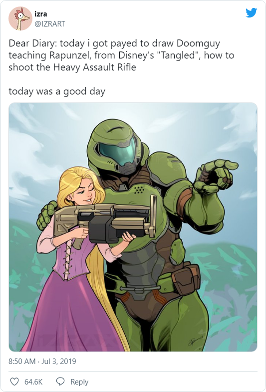

> Дорогой дневник! Сегодня мне заплатили, чтобы я нарисовал думгая, который учит Рапунцель из диснеевской «Запутанной истории» стрельбе из тяжелой штурмовой винтовки. Сегодня был хороший день!

>*― izra*

Обожаю художников. Особенные люди :-)

(а также на рисунке я, обучающий дочку, как рашить зилотами в Starcraft 2)