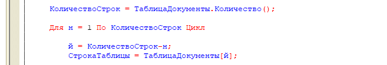

Всем привет! С вами снова Джонни Кэтсвилл и передача «Самодокументируемый код»!

Сегодня мы переберем строки таблицы значений с Н по Й:

Вроде и мелочь совсем, но когда в пределах одного модуля в пятый раз натыкаешься на такой подход к именованию переменных — глаз невольно начинает дергаться :-)

Дело даже не в том, что этот участок [труднее разобрать](/notes/why-so-serious) — просто он неплохо говорит о качестве модуля в целом. Скорее всего, писавший его программист был вымотан, и поблизости можно встретить что-нибудь вроде отважной выгрузки справочника номенклатуры в таблицу значений, чтения кучи объектов «через точку» и прочего тяп-ляп.