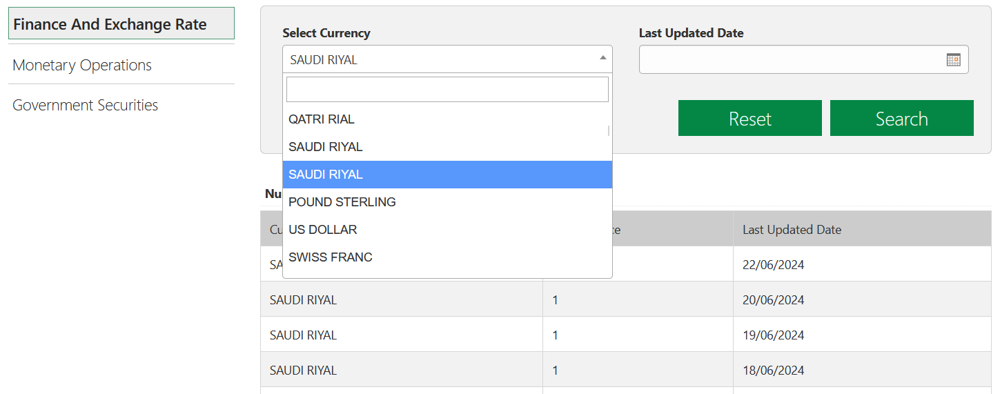

Можно ли любить валюту своей страны сильнее, чем жители Саудовской Аравии? Вопрос риторический: уверен, что нет.

Разглядываю [сайт](https://www.sama.gov.sa/en-US/FinExc/Pages/Currency.aspx) их центрального банка. Валюта страны — саудовский риал, и курсы других валют ЦБ устанавливает по отношению к ней. То есть, нет смысла спрашивать с банка курс самого риала. Однако сайт невозмутимо предлагает выбрать его дважды:

Для справки: первый вариант ломает интерфейс, а второй педантично выдает единицу на любую дату.

Другая забавная деталь: коллеги, кажется, хранят названия валют как строки длиной в 14 символов. Иначе сложно объяснить, почему по их данным в Канаде используется не канадский доллар, а CANADIAN DOLLA, а в Румынии — загадочный NEW ROMANIAN L вместо леи. Впрочем, этим двоим ещё повезло: Сингапур, например, ведёт расчёты в SINGAPORE DOLL.