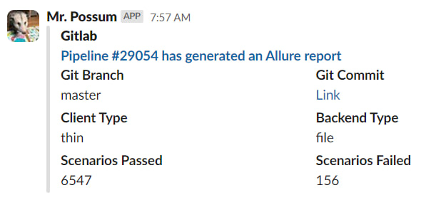

Попался под руку [скрипт](https://gist.github.com/vkostyanetsky/b0807f2df2501bbeeb97c95a977f3e23), который я пару лет назад накатал для рабочего GitLab'а. Вкратце: мы ежедневно прогоняем репозиторий разработки через прорву тестов на Ванессе, в результате чего получаем симпатичный отчет — сколько тестов выполнено, какие провалились, причины провалов и так далее.

Отчет нужно постоянно анализировать, хотя бы бегло. Конечно, полностью «зеленых» тестов мы уже давно не видели, и это нормально: например, в случае взаимозависимой разработки, когда коммиты ломают проверяемый функционал, и тесты еще предстоит поправить. Однако держать руку на пульсе все равно необходимо.

Чтобы упростить эту рутину, я немного расширил код пайплайна: после формирования отчета GitLab первым делом создает короткую сводку (тип клиента, тип базы, статистика по тестам) и отправляет ее в слак.

Как бонус, стало проще отвечать на философский вопрос «кто все сломал». Чаще всего — автор первого коммита, на котором метрика Scenarios Failed на скриншоте выше пробила потолок :)
