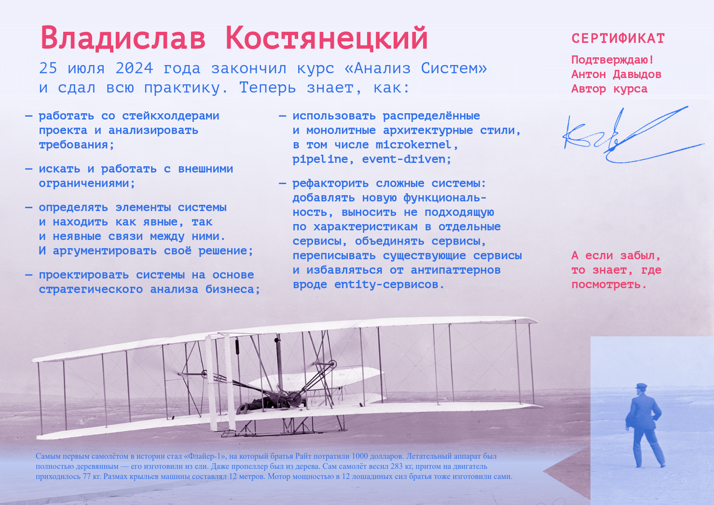

Среди всех этих пет-проектов и августовских переживаний забыл упомянуть, что завершил [курс](https://tough-dev.school/system-analysis) по анализу систем, о котором недавно [писал](/notes/ibrahim).

Курс был устроен так, что на протяжении всех занятий мы работали над одной и той же системой, выявляли проблемы и постепенно их решали. Перед первым уроком нам предложили спроектировать первую версию системы, чтобы потом, в конце курса, сравнить её с финальной версией и оценить прогресс. Так вот, сравнением я доволен — в том смысле, что на первую версию теперь без слез смотреть сложно :)

Времени для рефлексии на курсе было в целом мало, так что буду дальше работать над материалами и растаскивать уроки на личные заметки. Это не так-то просто, так как у нас в компании много специфики связано с решениями на базе 1С:Предприятия, и масса моей работы крутится вокруг разной обвязки 1С-инстансов на решениях вне стека 1С. 

Однако 1С-инстансы, кажется, можно воспринимать как монолиты с определенным набором характеристик (в зависимости от решаемых внутри задач), а в остальном коммуникации с ними мало чем отличаются от традиционных решений: те же события (например, кролик), те же входящие/исходящие HTTP-вызовы, тот же показатель instability и так далее.

На этом этапе я точно потащу (или уже потащил) к себе:

1. Распил ТЗ на нумерованные пункты (US-XXX) и хранение их в одном месте с пометками «updated at», «canceled at» и так далее. Кажется, удачный формат.
2. Ведение ADR. Собственно, это уже внедрил. Несколько смущает, правда, что в них периодически оседает что-то, что архитектурой в прямом смысле не является (например, принципы логирования событий на каком-то участке). Однако такие штуки тоже кажутся важными для принятия решений.
3. Event Storming как способ визуализации бизнес-процессов. Не могу сказать, что он сильно выигрывает по сравнению с той сборной солянкой, которая до этого обычно оседала у нас, но результат выглядит симпатично и вообще: какой-то стандарт лучше, чем никакого.
4. Диаграммы сервисов приложения с наклеенными стикерами, указывающими характеристики. Достаточно функционально, если надо взглянуть на проект с высоты птичьего полета и опять же не так сухо, как гигантские таблицы. То есть, если сработает bus factor — выше шанс, что следующий (или следующая) я заметит эти детали.
5. Хочу делать BPMN-ки и Activity Diagrams. Формат мне нравится, но пока мои попытки оставляют желать лучшего. Буду пробовать ещё.
6. Неожиданно зашел концепт разделения функционала для снижения зависимостей. Раньше казалось, что всегда проще склеить похожий функционал для снижения объёма кода, но это увеличивает и сложность, и внутреннюю связность — а значит, может сильно больше вредить, чем помогать.

В целом курсом очень доволен. Кажется, лучшее вложение сил за последний год. Если думаете идти туда, но сомневаетесь — идите :)