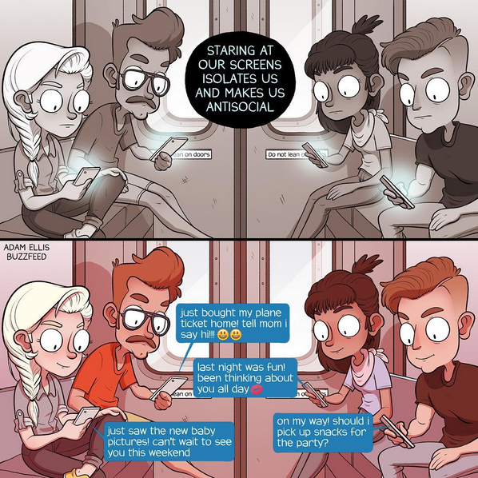

Художник — [Адам Эллис](https://www.patreon.com/adamtots).

По-моему, это отличная иллюстрация к вечному стону «чего они все таращатся в телефоны, бла-бла-бла». Причина проста, как три копейки — у людей в телефоне их друзья и подружки, книжки и подкасты, игры и ютуб. Всё это куда интереснее, чем, скажем, хмурый дядька или мрачная тётка с синдромом гуру.

То же касается и детей. Соцсети набиты спорами по этому поводу, как бочка селедкой, однако причина проблемы остаётся точно такой же: если подросток при виде вас утыкается в телефон, ему с вами попросту не интересно и проблема, очевидно, в вас самих.