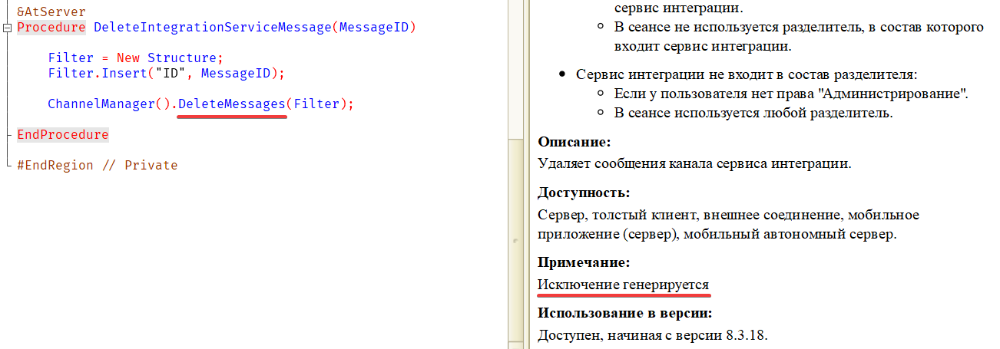
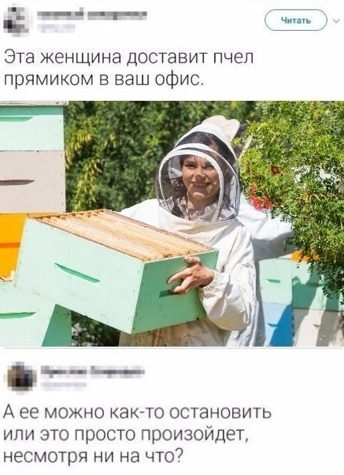

Немного экзистенциальной безысходности от СП (на случай, если вам её почему-то не хватало):

Это справка для метода УдалитьСообщения() менеджера канала сервиса интеграции. Если серьёзно, я понимаю, что тут имеется в виду: дело в том, что все методы сервисов интеграции швыряются исключениями, если их вызвать в сеансе со включенными разделителями. Авторы документации педантично сообщают об этом в справке по любому из них, так что здесь, видимо, просто почему-то кусок отвалился. В английской документации к этому методу, например, всё нормально.

Но все равно, забавно смотрится. Напомнило старый мем:

