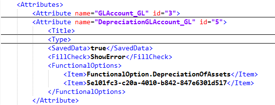
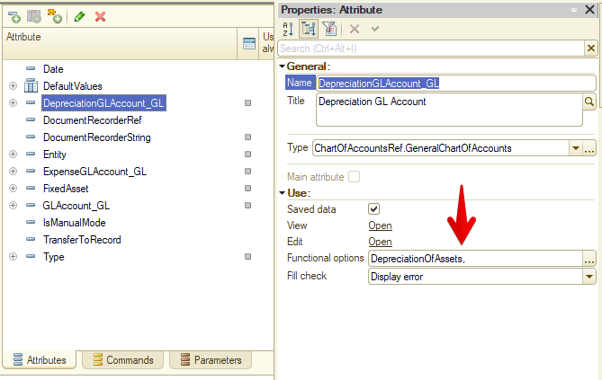
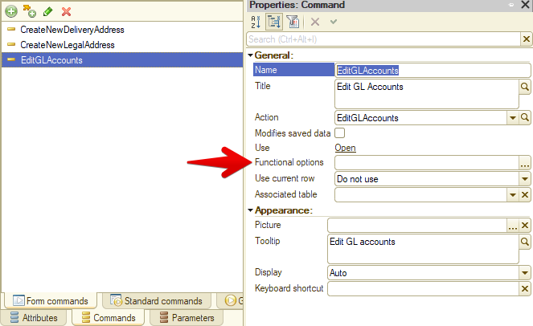

Приведу вариант решения проблемы [неразрешимых ссылок](/notes/unresolved-references), возникший после удаления функциональной опции. Вводная — при проверке конфигурации получаю десятка два сообщений вида:

    CommonForm.PersonalSettings.Form Unresolved metadata object references (2)
    Catalog.BankAccounts.Form.GLAccountsEditForm.Form Unresolved metadata object references (1)
    Catalog.CashRegisters.Form.GLAccountsEditForm.Form Unresolved metadata object references (1)

Выгружаю конфигурацию в файлы, открываю Form.xml для одной из проблемных форм. Начинаю с той, где элементов немного — так проблему заметить будет проще.

Бегло просматриваю файл в поисках чего-то необычного. Искать долго не приходится:

Нормальная ссылка на функциональную опцию — её имя (как в случае DepreciationOfAssets). А вот если вместо имени указан GUID — этой функциональной опции в конфигурации нет. Ссылка неразрешима.

Делаю поиск этого GUID'а по остальной выгрузке и нахожу почти все проблемы, на которые ссылалась платформа при проверке. Решить их легко: удалить битую ссылку из XML, а потом загрузить файл обратно в конфигурацию. Можно ещё проще: открыть список функциональных опций для элемента формы и тут же сохранить его. В этом случая битая ссылка также будет удалена.

Почему искать таких потеряшек через сам Конфигуратор — занятие для клинических оптимистов? Да просто проблему почти невозможно заметить. В лучшем случае вы увидите что-то в духе:

Конфигуратор понимает, что в поле две опции, но получить название для второй не может (её нет). А ведь чаще всего функциональная опция только одна! И картина выглядит так:

https://youtu.be/ihZyUBaG_8Y

