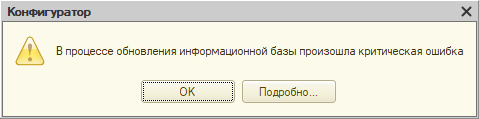
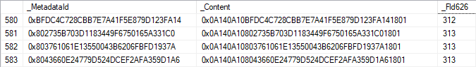

Итак, Конфигуратор выдает ошибку; нужно её исправить или обойти. Это потенциально неприятный расклад: у нас нет никакого доступа к коду приложения. Тем не менее, чтобы решить проблему — важно понять, что именно делал Конфигуратор до сбоя и почему он не справился.

Что может с этим помочь?

Первое — сам текст ошибки. Нередко его вполне достаточно, чтобы мысли двинулись в правильном направлении. Если причиной сбоя стал запрос, то в ошибке будет ещё и сообщение от СУБД.

Второе — технологический журнал по событиям EXCP, SDBL и DBMSSQL (DBPOSTGRS?) для t:applicationName=Designer. Из него мы получим информацию об исключениях внутри Конфигуратора и данные запросов, которые он выполняет (нередко они и есть причина ошибки).

Кроме того, может пригодиться трассировка запросов к базе данных. Если используется MS SQL, то трассировку можно получить через Extended Events — конкретно, нас интересуют события error_reported, rpc_completed и sql_batch_completed. Общий принцип тот же — ловим ошибки выполнения запросов и сами запросы. 

Разберем пример — может, не самый показательный, зато свежий.

Контекст — конфигурация, использующая [разделение данных](https://v8.1c.ru/platforma/razdelenie-dannyh/). Её база данных «нарезана» на кусочки (области данных), каждый из которых ничего не знает о своих соседях — сколько их, какого они размера и так далее. При этом в БД есть и общие данные — например, справочники, к которым можно обратиться из любой области. Как правило, это разная техническая информация — например, перечень объектов метаданных.

Задача — исключить справочник FileStorageVolumes из основного разделителя. Сейчас этот справочник — разделенный: то есть, его данные от области к области будут различаться. Нам нужно сделать так, чтобы содержимое справочника стало одинаковым для всех областей.

Задача несложная, так как таблица справочника пуста — ни одна из областей ничего в нем не хранит. Что же, применяем [настройку](setup.png) и:

В [тексте](error.txt) исключения есть сообщения: одно от платформы, второе от СУБД. Первое озадачивает: то есть как это данные не уникальны? Справочник же пуст, никаких данных нет. Возможно, проблема в каких-то вспомогательных структурах, не связанных с содержимым справочника напрямую.

Сообщение СУБД более внятное: MS SQL Server хотела создать уникальный индекс для таблицы _DataHistorySettingsNG, но не смогла, так как сочетания индексируемых полей оказались неуникальны. Приводится даже конкретное значение, из-за которого не получилось создать индекс: это NULL.

Выводы?

1. Очевидно, что проблема возникла в ходе реструктуризации. Во-первых, именно её мы и делали. Во-вторых, на это указывает и операция CREATE UNIQUE INDEX (создание индексов в таблицах — часть реструктуризации), и название проблемной таблицы: в нём есть постфикс NG (его получают копии таблиц, которые создаются при реструктуризации; если она проходит успешно, то платформа удаляет исходную таблицу и переименовывает копию).
2. Проблема возникла с настройками механизма истории данных (_DataHistorySettings). Там хранится статус каждого объекта метаданных: нужно или нет вести историю данных для объекта, его полей и полей его табличных частей (если они есть).

Последнее объясняет, почему проблема уникальности возникла на пустом справочнике: настройки истории данных для объекта хранятся независимо от того, есть в объекте какие-то данные или нет. Если посмотреть на таблицу с настройками, там всего три поля: _MetadataId (ID объекта метаданных), _Content (значения настроек) и _Fld626 (разделитель области).

До реструктуризации данные имеют примерно такой вид:

Однако потом эта картина изменилась. Когда мы исключили справочник из состава общего реквизита, конфигуратор запустил реструктуризацию: создал таблицу _DataHistorySettingsNG, перенес в неё данные из _DataHistorySettings и установил значение поля _Fld626 в NULL всем записям, которые относятся к справочнику FileStorageVolumes.

К чему это привело? А вот к чему: для справочника FileStorageVolumes появился целый ворох настроек, которые не относятся к какой-либо области. Это само по себе звучит нездорово, но настоящие проблемы начались, когда Конфигуратор попытался создать для таблицы кластерный индекс: он [строится](index.png) по полям _MetadataId и _Fld626, является уникальным и, соответственно, не может быть создан — в таблице множество записей, у которых различается только поле _Content, а _MetadataId и _Fld626 — гарантированно идентичны.

Для очистки совести посмотрим [техжурнал](20103116.log) (я вычистил оттуда нерелевантные события и другую постороннюю информацию). Наши догадки подтверждается: видим, как Конфигуратор создает и заполняет таблицу _DataHistorySettingsNG, пытается проиндексировать её, но получает ошибку и удаляет. В [трассировке](20103116.png) СУБД примерно та же картина.

На этом интересное заканчивается, так как решение достаточно очевидно: удаляем настройки истории данных для справочника во всей областях данных и повторяем реструктуризацию. Ошибку это не исправит, конечно; по хорошему, Конфигуратор должен предсказывать такую ситуацию и выдавать адекватное сообщение — как, например, при удалении измерения регистра сведений, которое приводит к нарушению уникальности измерений для записей регистра. Однако задача будет решена.

В общем, готово — мы великолепны!