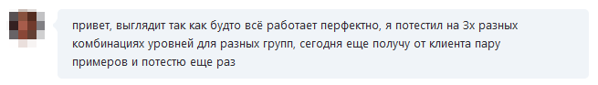



Фидбек — одна из самых клевых штук в моей профессии. Да, не первый год программирую, да, кучу всего написал, переписал и переделал, и всё равно каждый сложный механизм, наконец заработавший так, как надо — это... Ну, не знаю. Как снова и снова слышать «да» на выпускном бале :-)

Это несколько компенсирует обратную сторону медали — когда ты, например, в стопятый раз пытаешься разобраться в стопяти уровнях абстракции чьего-то приложения, ошибаешься снова и снова, за окном два часа ночи и вместо крови по венам давно бежит кофе.