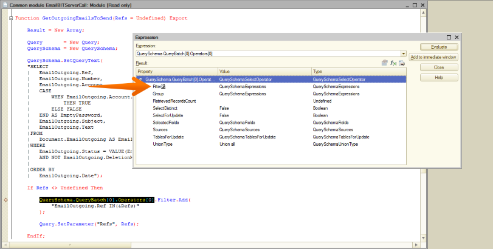

Я пишу на платформе 1С довольно давно и повидал некоторое дерьмо, но такое, честно говоря, вижу первый раз.

Поначалу я даже не понял, с какого конца это жевать. Поискал перевод иероглифа — Википедия лишь сухо сообщила, что это такой [тип чашки](https://en.wiktionary.org/wiki/%E4%80%80), а Google Translate вообще [развёл руками](https://translate.google.com/#view=home&op=translate&sl=auto&tl=ru&text=%E4%80%80).

Коллега заметил, что символ отдаленно похож на складского сортировщика — мол, перекладывает что-то там себе между коробками. Не знаю, не знаю. По-моему, больше напоминает барабанщика за работой. Но что, черт побери, это значит? Может быть, 1С пытается что-то мне сказать? Что-то про музыку?

Может, мне нужно было стать басистом, а не вот это всё.