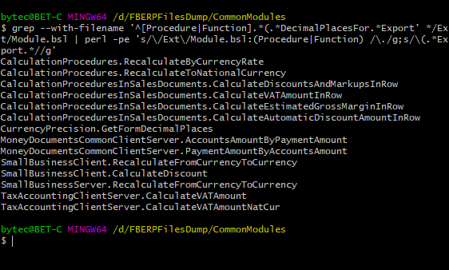

Задача: нужно найти в общих модулях конфигурации методы с определенным параметром (в этом примере — с параметром DecimalPlacesFor).

Обычный поиск по коду конфигурации даст массу ложных срабатываний (например, все обращения к параметру с таким именем в теле методов). Поиск по регулярным выражениям платформа пока не поддерживает, поэтому выгодно выгрузить конфигурацию в файлы и натравить на папку общих модулей [скрипт](https://github.com/vkostyanetsky/ScriptsForLogAnalysis/blob/master/Файлы%20конфигурации/MethodsWithParameter.sh) на баше.

Первая часть скрипта (до пайпа) выполняет сам поиск, вторая — отрезает лишнее, чтобы на вывод уходили только названия модулей и найденных в них методов. Получится, например, так:

Профит? Профит!