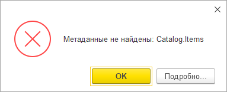

Думаю, с этой ошибкой мало кто сталкивался. Для этого, во-первых, нужно работать со встроенной в платформу историей данных, а она не больно-то популярна: кто-то привязан к БСП (она пока использует привычное всем версионирование на регистрах сведений), кому-то не нравится реализация — там и правда не всё гладко с точки зрения производительности.

Во-вторых, нужно сделать так: выключить историю данных для объекта метаданных, а потом грохнуть накопленные версии объектов **до того**, как новые изменения объекта перекочуют из буфера в основную таблицу.

В двух словах о том, как вообще работает история данных. По дефолту она выключена, и достаточно привилегированный пользователь может включить её для нужных ему объектов — констант, справочников, документов и так далее. После этого при изменении данных в этих объектах платформа будет фиксировать, что именно меняется. Делает она это в два этапа: сначала — относительно быстрая запись в промежуточный буфер (таблицу _DataHistoryQueue0); потом, при вызове метода ОбновитьИсторию(), информация мигрирует в основное хранилище версий (таблицу _DataHistoryVersions) и становится доступна в интерфейсе приложения.

Обновление истории можно делать сразу при записи, но для сокращения транзакции его обычно выносят в регламентное задание. В итоге миграция данных из буфера в основную таблицу происходит с некоторой периодичностью: например, раз в пять минут. Так вот, если между изменением данных объекта и обновлением истории данных выключить историю объекта и удалить его версии — метод ОбновитьИсторию() выкинет исключение: он попытается переместить изменения из буфера в основную таблицу, но не сможет привязать их к уже накопленным данным.

Для наглядности — [рабочий код](https://gist.github.com/vkostyanetsky/ca766fe281425953e0e2bbfe12fc70e2), воспроизводящий проблему для справочника Items на платформе 8.3.17.1989. Можете подставить любой другой объект, с которым работает история данных — разницы нет. 

**Как избежать этой ошибки?** Ну, очевидно: метод ОбновитьИсторию() нужно вызывать непосредственно перед тем, как отключать историю для объекта. Лучше всего делать это в период, когда пользователи с системой не работают: есть риск, что между обновлением истории и её выключением вклинятся чьи-то транзакции, которые спровоцируют ту же проблему. Для гарантии можно использовать монопольный режим.

Ещё в голову приходит исключительная блокировка на таблицу объекта, но документация не советует вызывать метод ОбновитьИсторию() внутри транзакций — так что тут я не уверен.

**Как исправить эту ошибку?** Включите историю данных для проблемного объекта, обновите историю и выключите её обратно. Выйдите, так сказать, из класса и зайдите нормально.