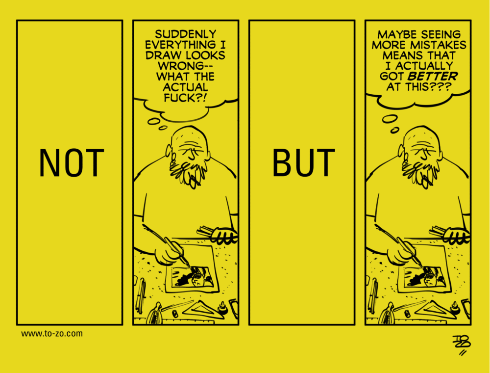

Про хорватский комикс [NOT/BUT](http://www.to-zo.com/notbut) мне кто-то рассказал в начале прошлого года, когда я всерьёз учился рисовать. Каждый стрип там — про какую-то травмирующую или просто мрачную мысль, которая приходит в голову художника во время работы. Идея в том, чтобы подтолкнуть читателя в правильном направлении и дать ему посмотреть на ситуацию, в которую он попал, с более практичной стороны.

Рисовать я бросил через год, в конце февраля: стало понятно, что времени на хобби у меня больше нет. Но комикс — совершенно универсальный; полистайте, даже если понятия не имеете, что такое клячка :-)

Все эти бесконечные самокопания хорошо знакомы любому профессионалу, а выход из них — не всегда очевиден. Особенно если ты зол, устал, а дедлайн по проекту истёк где-то на прошлой неделе.