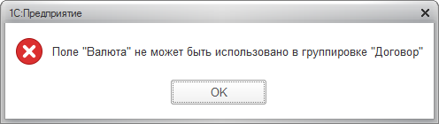

Универсальный подход системы компоновки данных «если у пользователя нет права на просмотр чего-то, то этого как бы нет» иногда заставляет платформу выкидывать знатные фортели. Нет, сферический отчет в вакууме и правда работает хорошо — например, если нет права на просмотр какого-то справочника, то в отчете он фигурировать не будет. Однако реальные примеры бывают посложнее.

Например, пару недель назад я отлаживал отчет, который при попытке генерации выдавал понятную на первый взгляд ошибку:

Отчет гигантский — запрос на добрую тысячу строк, сложная настройка, здоровенный макет, запутанный код компоновки. Первое подозрение пало на ошибку в настройке, но расследование быстро дошло от ссылки на валюту в выборке данных до чтения константы с этой валютой на самом нижнем уровне отчета, на которую не было права просмотра.

Не скажу сходу, что именно тут сбило платформу с толку и привело к не очевидной диагностике — то ли манипуляции с временной таблицей, куда эта константа была прочитана, то ли то, что читалась она в конструкции ВЫБОР, то ли то, что на сам справочник валют все необходимые права были. Искать конкретное условие или их сочетания я не стал — думаю, это просто специфика реализации движка СКД, которая может меняться от версии к версии. Достаточно не забывать о праве просмотра, и проблемы не будет.

Что касается ошибки, при столкновении с ней стоит вывести проблемный отчет под полными правами. Если тут всё о'кей, нужно набросать список таблиц, откуда отчет читает данные, и проверить — все ли они с правами на чтение и просмотр.

Нудно, но может сэкономить прилично времени.