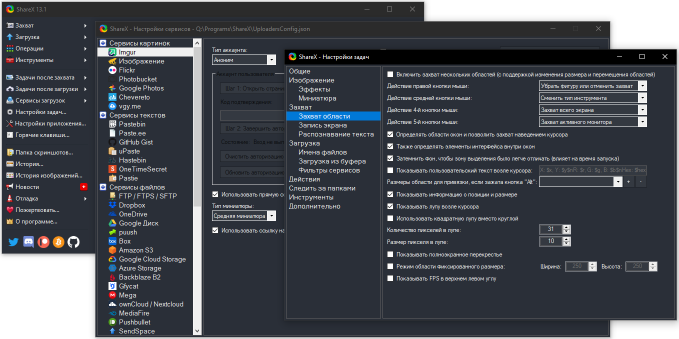

Прежде чем приспособить OBS Studio для записи видео (писал о ней в [предыдущей](/notes/video-recording) заметке), я пробовал использовать [ShareX](https://getsharex.com/). Программа поначалу неплохо справлялась, однако от неё пришлось отказаться из-за неприятного бага: иногда при попытке завершить запись софт портил полученное видео.

Я гуглил, но причину понять так и не смог. Впрочем, неудивительно — ShareX использует [ffmpeg](https://www.ffmpeg.org/) для записи видео, а это дитя опенсорца вместо адекватной диагностики невозмутимо вываливает целый рулон логов. Разбирать его без соответствующего опыта — занятие для клинического оптимиста.

Впрочем, как инструмент для создания скриншотов ShareX почти безупречна. Обилие опций слегка напоминает замотанного человека в приступе гиперактивности :-)

> — Протестирую сам! Сам все протестирую! И полы вымою!

> *[Эффективность не работает. Илья Якямсев](https://www.youtube.com/watch?v=K6oZuB8_dU8&feature=youtu.be&t=640)*