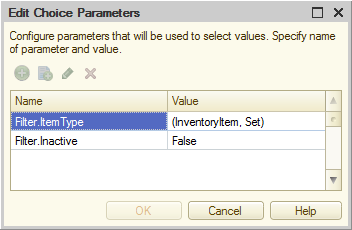

Пару недель назад мы добавили в справочник номенклатуры FirstBIT ERP параметр «Inactive». Задача была простой: если товар больше не нужен пользователю — он ставит галочку и тот исчезает отовсюду (из форм выбора, форм подбора остатков на складах и так далее).

Звучит несложно, правда? Техническая реализация тоже была простой — мы прошлись по всем объектам, в которых предполагается выбор номенклатуры, и добавили дополнительный параметр этого выбора.

Но пользователи начали жаловаться, что настройка не работает. Мы полезли разбираться и поняли, что забыли про историю ввода — этот механизм, как оказалось, параметры выбора просто игнорирует. То есть пользователи выбирали в инвойсе какой-то товар, потом делали его неактивным, возвращались и инвойс и... Снова видели в истории товар, который вроде только что отключили.

Мы принялись искать выход. Проблема в том, что история ввода хранится в системном хранилище и повлиять на неё программно нельзя. Можно разве что полностью удалить — но фактическая очистка истории происходит только при перезапуске клиента (и то через раз). Отключить историю вообще? Напоминает лечение простуды отсечением головы.

В какой-то момент мы наткнулись на информацию о том, что история ввода хранится не просто для конкретного поля, а ещё и в разрезе параметров выбора. То есть для каждого сочетания параметров выбора и их значений история выбора своя. Получается, если добавить некий дополнительный параметр выбора ко всем полям, где выбирается номенклатура — изменение значения этого параметра будет «чистить» историю (на самом деле, конечно, создавать новую — но пользователю-то какая разница).

В общем, мы создали такой параметр. Хранится в общем хранилище и транслируется в формы при их открытии через общий модуль, который программно добавляет параметр выбора. Если пользователь снимает или устанавливает флаг Inactive для любой номенклатуры — значение параметра меняется, а уже открытые формы получают его через механизм оповещений.

А ведь как все невинно начиналось, а?

Однако механизм неплохо работает, хотя его недостатки налицо: во-первых, системное хранилище будет постепенно пухнуть по мере появления всё новых и новых сочетаний реальных параметров выбора и нашего, фиктивного. Во-вторых, запись номенклатуры теперь потенциально узкое место: два пользователя не смогут одновременно записать номенклатуры, у которых изменены флаги Inactive (будет блокировка при записи нового значения нашего скрытого параметра выбора в общее хранилище).

Первую проблему можно решить очисткой хранилища по какому-то триггеру, вторую — записью нашего параметра выбора в разрезе пользователей (например, через регистр сведений). Впрочем, мы искренне надеемся, что 1С даст какой-то доступ к истории ввода до того, как нам придется городить дополнительные костыли к тем, что мы уже наворотили :-)