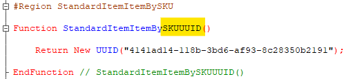

Пару недель назад Александр Кунташов у себя на канале [запостил](https://t.me/kuntashov_devnotes/479) забавный скрин перечисления из Библиотеки Электронных Документов, создателей которого откровенно манили длинные аббревиатуры. Я бодро острил на тему родства ИППДОИПУПДУКД'а и московского ГНУВНИВИПФИТ'а, а потом увидел в собственном коде вот эту красотку:

Ещё не вполне рука маэстро, конечно, но движение определенно в том же направлении. Вспомнилась притча про сучок в чужом глазу и суковатое бревно — в своём :-)