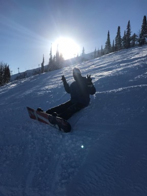

 

Летишь такой вниз по склону, в который раз пытаясь почувствовать точку равновесия и не полететь кубарем, но чувствуешь только отбитую задницу, а из головы не идет знаменитый спич Васа из третьего Far Cry.

> Я уже говорил тебе, что такое безумие, а? Безумие — это точное повторение одного и того же действия. Раз за разом, в надежде на изменение. Это есть безумие.

>*― Ваас Монтенегро, Far Cry 3*

Но вниз все равно приезжаешь невероятно довольный.

Магия какая-то.