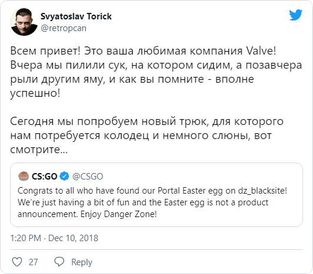

Ребята из Valve продолжают заигрывать с поклонниками своих игр — то ли по привычке, то ли там и правда кто-то считает, что это отличный способ напоминать о себе.

Конечно, с этой компанией как разработчиком игр всё в целом понятно. Мало кто всерьёз ждет третий Half-Life или, скажем, продолжение Portal. Но меня каждый раз умиляет это непринужденное изящество слона в посудной лавке, с которым Valve работает со своей аудиторией.

