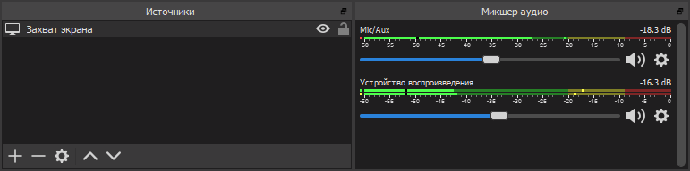

Я работаю удалённо и с коллегами общаюсь через Zoom и Slack. В основном в чатах, но многие темы по-прежнему проще обсудить голосом. И вот тут-то возникают проблемы: приходится забыть про индексацию и поиск по сообщениям, а главное — нет никакого архива разговоров. Иногда очень нужно вспомнить: кто говорил? Что конкретно? Когда?

Zoom и Slack сами по себе эту проблему не решают. Первый умеет записывать только те конференции, которые организуешь ты или которые тебе разрешили писать (короче, далеко не все), а второй писать видео не умеет вообще.

## Решение проблемы

Я закрыл вопрос какое-то время назад, поставив себе [OBS Studio](https://obsproject.com) — популярный среди стримеров софт для записи экрана. С записью конференций он прекрасно справляется. Настройка минимальная: пишем весь экран, звук с микрофона и все звуки, которые воспроизводятся. В микшере по результатам тестовых записей можно натыкать фильтры — усиление, шумоподавление и так далее.

В настройках нужно указать папку, куда будут складываться записанные видео (Вывод → Запись → Путь записи). Поскольку мы пишем звонки и файлов будет много, лучше сразу разложить их в папки по дням — для этого идем в расширенные настройки и в поле «Формат имени файла» указываем нечто вроде %CCYY-%MM-%DD/%hh-%mm-%ss.

## Быстрое управление записью

Конечно, лезть в OBS при каждом звонке неудобно, но у неё есть куча хоткеев — можно прожимать какие-нибудь заковыристые комбинации в начале и в конце разговора. Однако со мной это не сработало — придуманные хоткеи почему-то постоянно вылетали из головы. Даже стикеры не помогали. 

Поначалу я здорово разозлился, но потом понял: раз не получается запомнить хоткей — надо его выкинуть. Начинать запись нажатием одной кнопки, заканчивать нажатием на другую.

С оборудованием всё было просто: у меня эргономичная [клавиатура](https://www.microsoft.com/accessories/ru-ru/products/keyboards/natural-ergonomic-keyboard-4000/b2m-00020) от Microsoft, программируемых кнопок на ней — вагон. Хуже с софтом: OBS Studio понимает некоторые [параметры](https://github.com/obsproject/obs-studio/wiki/Launch-Parameters) запуска, но список откровенно бедноват — даже остановки записи нет. Хотелось бы побольше.

В итоге решил задачу через плагин к OBS Studio, который дает порулить запущенным экземпляром программы. Он придуман для удаленного управления записью (например, со смартфона), но никто не мешает использовать его локально.

Схема получилась такая:

1. Ставим OBS Studio и плагин [obs-websocket](https://obsproject.com/forum/resources/obs-websocket-remote-control-of-obs-studio-made-easy.466/) к ней. Снимаем галку «Enable System Tray Alerts» в настройках (Tools → WebSockets Server Settings), не то программа примется сообщать о каждом чихе.
2. Кладем куда-нибудь [утилиту](https://obsproject.com/forum/resources/command-line-tool-for-obs-websocket-plugin-windows.615/), с помощью которой этим плагином можно рулить из командной строки. 
3. Вешаем на одну кнопку OBSCommand.exe /startrecording, а на другую — OBSCommand.exe /stoprecording.
4. Готово, вы великолепны!

При вызове на долю секунду видно консоль (OBSCommand запускается, связывается с obs-websocket и ждет ответа). Сначала хотел как-нибудь скрыть это окно, но, поразмыслив, передумал — если OBS Studio не будет запущен или возникнет какая-то проблема, консоль не закроется и я хотя бы узнаю, что запись не началась.