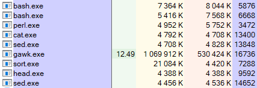

В прошлой заметке я говорил о задачах, для решения которых баш — идеальный инструмент: минимум ограничений, простые условия — и оговорился, что иногда он вообще не справляется.

Чтобы не быть голословным, давайте пример из практики. Есть, скажем, порядка семидесяти гигабайт логов ТЖ 1С, по которым нужно построить топ пояснений к исключениям — от самых частотных к менее частотным.

Плёвое дело, верно? Выгребаем EXCP, извлекаем Descr, считаем повторения. Даже нужный [скрипт](https://github.com/vkostyanetsky/ScriptsFor1C/blob/master/Технологический журнал/FrequentExceptions.sh) я как-то уже писал. Запускаю, терпеливо жду…

Знаете, сколько понадобилось времени? Я тоже нет: после того, как скрипт проработал сутки, я его вырубил и полез разбираться, в чём проблема. Затык возник где-то в скрипте gawk'а: именно она активно нагружала процессор (если не считать cat'а, которая время от времени читала очередную порцию данных).

Беда, беда, огорчение! В общем, я подумал и [переписал](https://github.com/vkostyanetsky/ScriptsFor1C/blob/master/Технологический журнал/FrequentExceptions.py) этот скрипт на Питоне. Новая версия отработала за 15 минут и дала мне:

1. Топ пояснений по событиям исключений;
2. Скрипт, который можно прочитать через полгода без помощи гугла;
3. Уверенность, что я могу добавить в скрипт два-три условия и не вызвать Сатану случайным сочетанием операторов и ключей.

Конечно, я мог оптимизировать версию на баше. Вероятно, тормозит поиск в массиве — время, необходимое для поиска пояснения в массиве уже зафиксированных пояснений, линейно растет с увеличением размера массива. Можно, например, попробовать изменить подход к сбору данных — gawk'ом только извлекать сами пояснения, а результат сбора передать в тандем sort & uniq.

Однако это уже отчётливо отдаёт [мемасом](but-why.jpg) про буханку хлеба: из неё, конечно, можно сделать троллейбус, просто не очень понятно — зачем? Камон, мне бы проблему решить. А Питон с ней уже справился на твердую пятёрку, чем сэкономил мне кучу времени и нервов.

Собственно, к этому я вел. Родовые травмы баша понятны и нередко приемлемы, плюсы — приятны и очевидны, но при работе с ним вопрос иногда встает так: cтоит ли только ради того, чтобы получить решение именно на баше, потратить часа два на возню с утилитами, параметрами, мануалами и постами на Stack Overflow? 

Вот поэтому не баш, да.