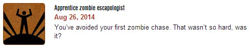

Я, как и все толстяки, не очень-то люблю бегать и трай-хард со мной не проходит абсолютно — два-три дня волевых усилий и всё, матушка лень да батюшка стрём.

Пришлось как следует заморочиться с мотивацией; в итоге нашлась смартфонная игрушка «[Zombies, Run!](https://zombiesrungame.com/)». По факту — тупо плеер, втыкаешь плейлист и идешь гулять. Однако привычные треки перемежаются незатейливым сюжетом про выживание в типичном зомбиленде: твой вертолёт потерпел крушение и ты пытаешься добраться до выживших. Ищешь припасы, медикаменты... И вокруг тебя зомби, так что если хочешь жить — шевели задницей.

Джи-и-изус Христ! Это офигительно. Не знаю, заслуга это игры или моего воображения, но сотни тысяч фрагов в Left 4 Dead мне не помогли никак — под рычание за спиной бежится невероятно хорошо! Игра, причем, беспристрастно сообщает, на каком расстоянии очередной мертвец; когда один такой прыгнул ко мне разом на сорок метров — я выдал, наверное, лучший спринт в своей жизни.

(под конец второй прогулки runner five, вдобавок, повредил ногу и начал очень аутентично хромать, что добавило драматизма и погружения в атмосферу)